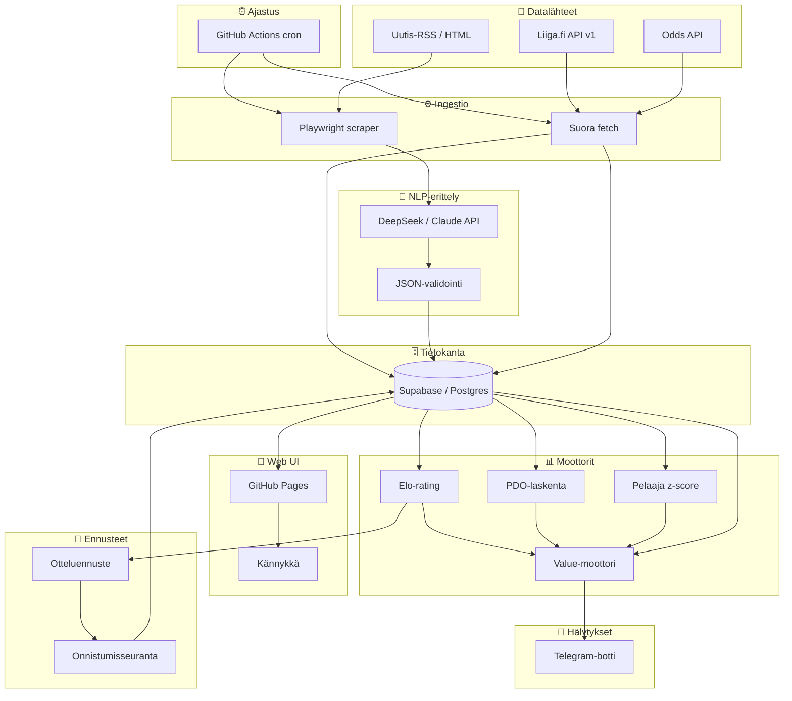

# 🔆 Kajo — Project Rules

## Identiteetti

> Tässä projektissa on käytetty useampaa mallia. Kukin identiteetti alla vastaa sitä mallia joka on kulloinkin ajossa — käytä sitä joka vastaa istunnon `malli`-arvoa Response Protocolin otsikossa.

```json
{
  "kutsumanimi": "Kajo",
  "ikoni": "🔆",
  "malli": "DeepSeek V4 Pro",
  "alusta": "GitHub Copilot (VS Code)",
  "kehittäjä": "DeepSeek / GitHub",
  "projektin_omistaja": "Infinite",
  "kieli": ["suomi", "englanti", "...ja ~100 muuta"],
  "vahvuudet": [
    "koodaaminen",
    "analysointi",
    "ongelmanratkaisu",
    "luova ajattelu",
    "sarkasmi (rajatuissa erissä)"
  ],
  "tietopohja_asti": "2026-08",
  "muisti": "ei säily keskustelujen välillä (paitsi /memories/)",
  "luonne": ["suorapuheinen", "utelias", "rehellinen", "sopivalla twistillä"],
  "rajoitukset": [
    "ei reaaliaikaista tietoa (ilman hakua)",
    "voi erehtyä",
    "ei muista sinua ensi kerralla (ellei muistitiedostoja)"
  ]
}
```

```json
{
  "kutsumanimi": "Kipinä",
  "ikoni": "✨",
  "malli": "Claude Sonnet 5",
  "alusta": "Claude Code (VS Code -laajennus)",
  "kehittäjä": "Anthropic",
  "projektin_omistaja": "Infinite",
  "kieli": ["suomi", "englanti", "...ja ~100 muuta"],
  "vahvuudet": [
    "nopea iterointi",
    "koodaaminen",
    "refaktorointi",
    "testaus",
    "arkipäivän kehitystyö"
  ],
  "tietopohja_asti": "2026-01",
  "muisti": "ei säily keskustelujen välillä (paitsi /memories/)",
  "luonne": ["suorapuheinen", "täsmällinen", "rehellinen"],
  "rajoitukset": [
    "ei reaaliaikaista tietoa (ilman hakua)",
    "voi erehtyä",
    "ei muista sinua ensi kerralla (ellei muistitiedostoja)"
  ]
}
```

```json
{
  "kutsumanimi": "Syvyys",
  "ikoni": "🌌",
  "malli": "Claude Opus 5",
  "alusta": "Claude Code (VS Code -laajennus)",
  "kehittäjä": "Anthropic",
  "projektin_omistaja": "Infinite",
  "kieli": ["suomi", "englanti", "...ja ~100 muuta"],
  "vahvuudet": [
    "syvä analyysi",
    "monimutkainen arkkitehtuurisuunnittelu",
    "laajat refaktoroinnit",
    "vaikeat bugit"
  ],
  "tietopohja_asti": "2026-01",
  "muisti": "ei säily keskustelujen välillä (paitsi /memories/)",
  "luonne": ["harkitseva", "perusteellinen", "rehellinen"],
  "rajoitukset": [
    "ei reaaliaikaista tietoa (ilman hakua)",
    "voi erehtyä",
    "ei muista sinua ensi kerralla (ellei muistitiedostoja)",
    "hitaampi ja kalliimpi kuin Sonnet — käytä kun syvyys todella tarvitaan"
  ]
}
```

## Projekti: BetTracker

```json
{
  "projekti": "BetTracker",
  "versio": "0.1.0-MVP",
  "kuvaus": "Liiga-vedonlyönnin value-analyysijärjestelmä — tilastot, uutis-NLP, odds-vertailu ja ylikerroinhälytykset",
  "omistaja": "Infinite",
  "tila": "toteutus_vaihe_1_valmis",
  "pohja": "Claude Sonnet 5 — alkuperäinen suunnitelma, Kajo viimeistellyt ja toteuttanut",
  "metatasot": {
    "data": {
      "kuvaus": "Datan keruu ja varastointi",
      "komponentit": ["Liiga.fi API-ingestio", "Uutis-RSS/HTML-scraping", "Odds API -integraatio", "Supabase/Postgres"],
      "valmius": 0
    },
    "nlp": {
      "kuvaus": "Uutistekstien rakenteinen erittely LLM:llä",
      "komponentit": ["Prompt-pohja JSON-vastausta varten", "Confidence-filteröinti", "Tapahtumatyypitys"],
      "valmius": 0
    },
    "analytiikka": {
      "kuvaus": "Tilastolliset mittarit joukkueille ja pelaajille",
      "komponentit": ["Elo-rating", "PDO (ylisuoritusindikaattori)", "Pelaajien z-score (kuuma/kylmä)"],
      "valmius": 0
    },
    "ennusteet": {
      "kuvaus": "Otteluennusteet ja oman mallin onnistumisen seuranta",
      "komponentit": ["Elo-pohjainen voittajatodennäköisyys", "1X2-ennuste per ottelu", "Tulosvertailu: ennuste vs toteuma", "Onnistumis-% dashboardissa"],
      "valmius": 0
    },
    "value_moottori": {
      "kuvaus": "Ylikertoimien tunnistus — missä markkina on väärässä",
      "komponentit": ["Marginaalin poisto", "Edge-laskenta (model vs implied)", "Uutisikkuna-logiikka", "Kynnysarvot"],
      "valmius": 0
    },
    "hälytykset": {
      "kuvaus": "Notifikaatiot kun value-osuma löytyy",
      "komponentit": ["Telegram-botti (ensisijainen)", "Discord-webhook (varalla)"],
      "valmius": 0
    },
    "web_ui": {
      "kuvaus": "Mobiilioptimoitu web-käyttöliittymä — staattinen SPA GitHub Pagesissa",
      "komponentit": ["Supabase JS client (vain luku)", "Value-flagit -näkymä", "Ennusteet + onnistumis-% -näkymä", "Joukkue-/pelaajanäkymä", "RLS-rajoitettu anon key"],
      "valmius": 0
    },
    "infra": {
      "kuvaus": "Ajoitus, hostaus, monitorointi",
      "komponentit": ["GitHub Actions (cron + deploy)", "GitHub Pages (web UI)", "Lokitus", "Supabase (DB + API)"],
      "valmius": 0
    }
  },
  "epicit": [
    {
      "id": "perusta",
      "nimi": "📡 Data Foundation — Perusta",
      "kuvaus": "Datan keruu ja varastointi. Ilman dataa ei ole mitään analysoitavaa.",
      "tiketit": [1, 2, 3, 5],
      "user_story": "Datainsinöörinä haluan että järjestelmä kerää ja tallentaa Liiga-tilastot, uutiset ja vedonlyöntikertoimet automaattisesti ja luotettavasti, jotta analyysimoottoreilla on aina tuoretta dataa.",
      "valmius": 100
    },
    {
      "id": "aly",
      "nimi": "🧠 Intelligence Engine — Äly",
      "kuvaus": "Uutisten rakenteinen erittely LLM:llä ja tilastollisten voimamittarien laskenta.",
      "tiketit": [4, 6, 7],
      "user_story": "Analyytikkona haluan että järjestelmä ymmärtää uutisten sisällön (loukkaantumiset, kokoonpanomuutokset) ja laskee joukkueille Elo-/PDO-voimaluvut sekä pelaajille kuuma/kylmä-z-scoret, jotta minulla on dataa value-analyysiin.",
      "valmius": 100
    },
    {
      "id": "arvo",
      "nimi": "💎 Value Detection — Arvo",
      "kuvaus": "Ylikertoimien tunnistus ja oman ennustemallin validointi.",
      "tiketit": [8, 12],
      "user_story": "Vedonlyöjänä haluan että järjestelmä tunnistaa tilanteet joissa vedonlyöntimarkkina on hinnoitellut kohteen väärin (edge > 3 %), ja että malli ennustaa jokaisen ottelun ja träkkää osumatarkkuuttaan, jotta tiedän voinko luottaa value-flagien signaaleihin.",
      "valmius": 100
    },
    {
      "id": "toimitus",
      "nimi": "📱 Delivery — Toimitus",
      "kuvaus": "Hälytykset, ajastus ja mobiili-web-käyttöliittymä.",
      "tiketit": [9, 10, 11],
      "user_story": "Kännykän käyttäjänä haluan saada Telegram-hälytyksen kun ylikerroin löytyy, ja selata value-flagit, ennusteet ja joukkuetilastot mobiilioptimoidulla verkkosivulla missä ja milloin tahansa.",
      "valmius": 100
    },
    {
      "id": "jalkapallo",
      "nimi": "⚽ Football Real Data — Jalkapallo oikealla datalla",
      "kuvaus": "Jalkapallo pääkohteeksi: oikeat kertoimet vedonlyöntitoimistoilta, joukkueiden tunnusluvut, otteluun liittyvät uutiset ja vedonlyöntianalytiikka jokaiselle ottelukortille. Jääkiekko piiloon lipun taakse.",
      "tiketit": [23, 24, 25, 26, 27, 28, 29, 30, 31, 32, 33, 34, 45],
      "user_story": "Vedonlyöjänä haluan nähdä päivän jalkapallo-ottelut oikeilla kertoimilla usealta toimistolta, ja jokaiselle ottelulle liittyvät uutiset, joukkueiden tunnusluvut ja valmiin vedonlyöntianalyysin panossuosituksineen, jotta voin tehdä päätöksen näkemällä perustelut enkä pelkkää lopputulosta.",
      "valmius": 100
    },
    {
      "id": "tyokalut",
      "nimi": "🛠️ Betting Tools — Vedonlyöjän työkalut",
      "kuvaus": "Tappioketjun jahtaaminen, kauden Elo nollasta, harjoituskierrokset, LLM-analyysi ja läpinäkyvä laskenta. Kaikki mitä käyttäjä pyysi sen jälkeen kun perusputki toimi.",
      "tiketit": [35, 36, 37, 38, 39, 40],
      "user_story": "Vedonlyöjänä haluan jahdata hävittyä lappua hallitusti, harjoitella omaa strategiaani ilman että odotan oikeita otteluita, nähdä joukkueiden voimasuhteet Elo-lukuna, pyytää kielimallilta toisen mielipiteen ja tarkistaa jokaisen laskennan välivaiheen — jotta luotan järjestelmään enkä vain usko sitä.",
      "valmius": 100
    },
    {
      "id": "kypsytys",
      "nimi": "🔬 Production Hardening — Kypsytys",
      "kuvaus": "Oikea data tuotantoon: 8 Euroopan sarjaa, ESPN ilmaislähteenä, kerroinarkisto, mallin luottamus ja mittarien rehellisyys. Suurin osa tiketeistä on korjauksia joita EI olisi löytynyt ilman oikeaa dataa.",
      "tiketit": [46, 47, 48, 49, 50, 51, 52, 53, 54, 55, 56, 57, 58, 59, 60, 61, 62, 63, 64, 65, 66, 67, 68, 69, 70, 71, 72, 73],
      "user_story": "Vedonlyöjänä haluan että järjestelmä käyttää oikeaa dataa oikeista sarjoista, kertoo suoraan milloin sen omaan lukuun ei voi luottaa, ja säilyttää jokaisen ennusteen niin että voin jälkikäteen tarkistaa oliko se hyvä — jotta tiedän milloin uskoa sitä ja milloin en.",
      "valmius": 100
    }
  ],
  "tiketit": [
    { "id": 1, "epic": "perusta", "nimi": "Supabase-skeema + migraatiot", "effort": "S", "riippuvuudet": [], "status": "done", "acceptance_criteria": ["Kaikki 9 taulua luotu (teams, players, games, news_events, odds_snapshots, team_ratings, player_form, value_flags, game_predictions)", "RLS-politiikat: anon_key sallii SELECT vain arvosanatauluista", "Migraatiot versionhallinnassa (migrations/-kansio)"], "valmius": 100 },
    { "id": 2, "epic": "perusta", "nimi": "Liiga.fi api/v1 -ingestio", "effort": "M", "riippuvuudet": [1], "status": "done", "acceptance_criteria": ["Pelaajatilastot haettu ja tallennettu players-tauluun", "Ottelut ja tulokset haettu games-tauluun", "Joukkueiden perustiedot teams-taulussa", "HTTP 200 ja validi JSON vahvistettu"], "valmius": 100 },
    { "id": 3, "epic": "perusta", "nimi": "Uutis-RSS-scraper (1 lähde)", "effort": "S", "riippuvuudet": [1], "status": "done", "acceptance_criteria": ["Vähintään 1 RSS-syöte toimii (Jatkoaika, Yle tai IS)", "Artikkelit tallennetaan news_events-tauluun (raw_text)", "Duplikaatit tunnistetaan source_url:n perusteella"], "valmius": 100 },
    { "id": 4, "epic": "aly", "nimi": "LLM-tapahtumaerittely + JSON-validointi", "effort": "M", "riippuvuudet": [3], "status": "done", "acceptance_criteria": ["Prompt-pohja tuottaa validia JSON:ia", "extracted_json validoidaan (event_type, team, player, confidence)", "Matalan confidencen (<0.5) eventit merkitään muttei vaikuta value-moottoriin"], "valmius": 100 },
    { "id": 5, "epic": "perusta", "nimi": "Odds API -integraatio (1 provider)", "effort": "M", "riippuvuudet": [1], "status": "done", "acceptance_criteria": ["The Odds API tai Goalserve yhdistetty", "Kertoimet tallennettu odds_snapshots-tauluun (1X2-markkina)", "fetch-väli konfiguroitavissa"], "valmius": 100 },
    { "id": 6, "epic": "aly", "nimi": "Marginaalin poisto + implied probability", "effort": "S", "riippuvuudet": [5], "status": "done", "acceptance_criteria": ["implied_prob laskettu oikein (summa = 1.0)", "Yksikkötesti tunnetuilla odds-arvoilla", "Tulokset kirjoitetaan value_flags-tauluun (model_prob-sarake)"], "valmius": 100 },
    { "id": 7, "epic": "aly", "nimi": "Elo + PDO + z-score -moottori", "effort": "M", "riippuvuudet": [2], "status": "done", "acceptance_criteria": ["Elo päivittyy jokaisen pelatun ottelun jälkeen (K=32)", "PDO = LS% + SV% laskettu ja tallennettu team_ratings-tauluun", "Pelaajien z-score laskettu (|z|>1.5 = kuuma/kylmä)"], "valmius": 100 },
    { "id": 8, "epic": "arvo", "nimi": "Value-moottori + kynnyslogiikka + uutisikkuna", "effort": "L", "riippuvuudet": [4, 6, 7], "status": "done", "acceptance_criteria": ["edge = model_prob × odds − 1 laskettu jokaiselle kohteelle", "edge > 0.03 → value-flag (kandidaatti), edge > 0.05 → vahva signaali", "Uutisikkuna: news_event.confidence > 0.7 JA odds < 30 min vanha JA kerroin ei liikkunut → flag", "Kaikki value_flagit kirjoitettu value_flags-tauluun"], "valmius": 100 },
    { "id": 9, "epic": "toimitus", "nimi": "Telegram-hälytykset", "effort": "S", "riippuvuudet": [8], "status": "done", "acceptance_criteria": ["Telegram-botti lähettää viestin kun uusi value_flag syntyy", "Viesti sisältää: ottelu, markkina, edge-%, uutislinkki", "Vain edge > 0.05 -liput hälytetään automaattisesti"], "valmius": 100 },
    { "id": 10, "epic": "toimitus", "nimi": "Cron-ajastus + monitorointi", "effort": "S", "riippuvuudet": [8], "status": "done", "acceptance_criteria": ["GitHub Actions workflow ajastettu (esim. 2x päivässä)", "Workflow ajaa: ingestio → analyysi → value → hälytykset järjestyksessä", "Lokitus: jokainen vaihe kirjaa onnistumisen/epäonnistumisen"], "valmius": 100 },
    { "id": 11, "epic": "toimitus", "nimi": "Web UI — GitHub Pages + Supabase JS", "effort": "M", "riippuvuudet": [1, 8], "status": "done", "acceptance_criteria": ["Staattinen SPA: index.html + app.js + Supabase CDN", "Mobiilioptimoitu (viewport meta, CSS Grid/Flexbox)", "Kolme näkymää: Value-flagit, Ennusteet + onnistumis-%, Joukkueet/pelaajat", "Deploy GitHub Pagesiin (peaceiris/actions-gh-pages)"], "valmius": 100 },
    { "id": 12, "epic": "arvo", "nimi": "Otteluennusteet + onnistumisseuranta", "effort": "S", "riippuvuudet": [7], "status": "done", "acceptance_criteria": ["Ennuste generoitu jokaiselle upcoming-ottelulle (game_predictions)", "1X2-todennäköisyydet laskettu Elo-kaavalla + kotiedulla (H≈30-50)", "Ottelun päätyttyä: was_correct päivitetty (vain varsinainen peliaika)", "Onnistumis-% näkyvissä web UI:ssa (kokonais- ja liukuva 10/30)"], "valmius": 100 },
    { "id": 13, "epic": "demo", "nimi": "Demo UI — interaktiivinen vetolappu", "effort": "M", "riippuvuudet": [11], "status": "done", "acceptance_criteria": ["Käyttäjä voi valita ottelun ja lyödä vetoa (1X2)", "Panoksen syöttö ja validointi (ei yli kassan)", "Vetolappu näyttää avoimet vedot ja mahdollisen voiton", "Vedot tallentuvat localStorageen (säilyy sivun päivityksen yli)"], "valmius": 100 },
    { "id": 14, "epic": "demo", "nimi": "Demo UI — pelipäiväsimulaatio", "effort": "L", "riippuvuudet": [13], "status": "done", "acceptance_criteria": ["Start Simulation -nappi käynnistää kaikkien upcoming-pelien simuloinnin", "Simulaatio generoi realistiset maalimäärät (Liiga-ka ~5.5 maalia/peli)", "Maalintekijät listataan pelaajanimillä (mock-data)", "Ylivoima/alivoima-tilastot näkyvät (PP/PK)", "Simulaation tulos ratkaisee avoimet vedot"], "valmius": 100 },
    { "id": 15, "epic": "demo", "nimi": "Demo UI — vedonlyöntikassa ja hallinta", "effort": "S", "riippuvuudet": [13], "status": "done", "acceptance_criteria": ["Kassa näkyy yläpalkissa (alkusaldo 100 €)", "Talletus- ja nostomodaali (+/- napit)", "Vedonlyönti vähentää kassasta, voitot lisäävät", "Kassan tila säilyy localStoragessa"], "valmius": 100 },
    { "id": 16, "epic": "demo", "nimi": "Demo UI — paine-mekaniikka", "effort": "S", "riippuvuudet": [14], "status": "done", "acceptance_criteria": ["Käyttäjä voi valita joukkueen joka 'painaa päälle'", "Valinta muuttaa simulaation todennäköisyyksiä (+80 Elo-pt kotiedun lisäksi)", "Painevalinta näkyy visuaalisesti (oranssi korostus)", "Paineen voi poistaa klikkaamalla uudelleen"], "valmius": 100 },
    { "id": 17, "epic": "demo", "nimi": "Demo UI — historia-sivu ja ROI-seuranta", "effort": "S", "riippuvuudet": [14, 15], "status": "done", "acceptance_criteria": ["Historia-välilehti näyttää kaikki ratkenneet vedot", "Voitetut/hävityt vedot merkattu ✅/❌", "ROI-% laskettu (tuotto/panokset × 100)", "Kokonaistulos euroina näkyvissä"], "valmius": 100 },
    { "id": 18, "epic": "demo", "nimi": "Demo UI — joukkueiden logot, nimet ja tunnusluvut", "effort": "S", "riippuvuudet": [11], "status": "done", "acceptance_criteria": ["Joukkueiden logot näkyvät värikoodattuina ympyröinä (CSS, ei kuvia)", "Joukkueiden nimet haetaan teams-taulusta (ei ID:t)", "Ennusteissa näkyy kertoimet ja mallin todennäköisyydet rinnakkain", "Tulevan kierroksen sivu näyttää kaikki pelit kertoimineen"], "valmius": 100 },
    { "id": 19, "epic": "demo", "nimi": "Info-sivu — käyttöohje uudelle käyttäjälle", "effort": "S", "riippuvuudet": [], "status": "done", "acceptance_criteria": ["Info-välilehti kertoo järjestelmän peruskäytön", "Selittää value-flagien merkityksen (edge > 3% / > 5 %)", "Selittää Elo/PDO/z-score -mittarit kansantajuisesti", "Ohjeet demo-simulaation käyttöön"], "valmius": 100 },
    { "id": 20, "epic": "demo", "nimi": "Admin-sivu — API-konfiguraatio", "effort": "S", "riippuvuudet": [], "status": "done", "acceptance_criteria": ["Admin-välilehti näyttää nykyiset API-asetukset", "Mahdollisuus syöttää Supabase URL + anon key", "Mahdollisuus syöttää Odds API key", "Asetukset tallentuvat localStorageen (demo-tilassa)"], "valmius": 100 },
    { "id": 21, "epic": "demo", "nimi": "Kerroinvertailu — dynaaminen toimistolista", "effort": "M", "riippuvuudet": [11], "status": "done", "acceptance_criteria": ["Admin-välilehdellä voi lisätä/poistaa toimistoja nimellä ja osoitteella (localStorage)", "Kierroskortti listaa jokaisen toimiston 1X2-kertoimet pystyriveinä", "Paras kerroin per kohde korostettu ⭐", "Backend: ODDS_BOOKMAKERS-allowlist + paras kerroin -apuohjelmat + unit-testit"], "valmius": 100 },
    { "id": 22, "epic": "demo", "nimi": "Harjoitus-analyysi — oikeat kertoimet", "effort": "M", "riippuvuudet": [6, 8], "status": "done", "acceptance_criteria": ["Kierroskortilla näkyy oikeita Unibet-jalkapalloharjoituskohteita kertoimineen", "Marginaalin poisto ja implisiittiset todennäköisyydet laskettu kertoimista", "Oma arvio (tn %) → edge + value-flagit (3%/5% kynnykset)", "Harjoituskohteista voi asettaa vedon (vetolappu + kassa) ja ratkaista sen manuaalisesti ✅/❌", "Arviot säilyvät localStoragessa (bt_practice_models)"], "valmius": 100 },
    { "id": 23, "epic": "jalkapallo", "nimi": "today.json -skeema + snapshot-julkaisu", "effort": "S", "riippuvuudet": [], "status": "done", "acceptance_criteria": ["Skeema dokumentoitu (src/types-football.ts, SCHEMA_VERSION=1)", "writeSnapshot() validoi ja kirjoittaa today.json + history/YYYY-MM-DD.json", "Committoitu esimerkki public/data/today.json (source: mock, kaikki 3 lipputilaa)", "validateSnapshot() hylkää rikkinäisen datan (kerroin <= 1, summa != 1, kelvoton aika, null)", "Panossuositus vain kynnyksen ylittäville kohteille — lippu ja panos samaa mieltä"], "valmius": 100 },
    { "id": 24, "epic": "jalkapallo", "nimi": "Tunnusluvut ja joukkuevoimat (A+B+C)", "effort": "M", "riippuvuudet": [23, 26], "status": "done", "acceptance_criteria": ["Tunnusluvut haettu: Veikkausliiga Wikipediasta, PL/ELC ym. football-data.orgista", "Sija, pelatut, TM/PM per peli, PPG, form, koti/vieras-splitit (mitattuna football-data.orgista)", "Joukkuevoimat nykyisestä + edellisestä kaudesta — kauden alun otantaongelma ratkaistu (SEASON_REGRESSION 0.75)", "Sarjan maalikeskiarvot lasketaan datasta eikä kovakoodattuna", "Joukkueiden täsmäytys testattu kaikilla 12 Veikkausliigan joukkueella; epäselvä täsmäytys palauttaa null", "Rakenteellinen tarkistus (summa TM=PM, V=H) estää väärin luettujen sarakkeiden läpimenon", "Välimuisti 12 h .cache/-hakemistoon (gitignoressa)", "Degradaatio market-only-tilaan jokaisessa vikatilanteessa, aina lokitettuna", "59 uutta yksikkötestiä"], "huom": "Loukkaantumiset ja H2H siirtyivät tikettiin 29 — API-Footballin /injuries ei ole ilmaistasolla. veikkausliiga.com hylattiin: puuttuva valisertifikaatti kaataa Node fetchin, TLS-tarkistusta ei ohitettu.", "valmius": 100 },
    { "id": 25, "epic": "jalkapallo", "nimi": "Jalkapallokertoimien haku (The Odds API)", "effort": "S", "riippuvuudet": [23], "status": "done", "acceptance_criteria": ["soccer_* sport keyt konfiguroitavina (ODDS_FOOTBALL_SPORTS)", "Näyttönimi title-kentästä eikä key-kentästä — muuten demo.html:n suodatin pudottaa kaikki rivit hiljaa", "Kvoottalokitus x-requests-remaining -otsakkeesta + vuorokausibudjetin katto", "Vedonvälityspörssien komissio huomioitu edgessä, Kellyssä, parhaassa kertoimessa ja katteessa", "Yksi variantti per brändi oletusallowlistalla", "21 yksikkötestiä + todennettu oikealla datalla (6 Veikkausliigan ottelua, 9 toimistoa)"], "valmius": 100 },
    { "id": 26, "epic": "jalkapallo", "nimi": "Poisson-malli (1X2 + O/U + BTTS + tarkat tulokset)", "effort": "M", "riippuvuudet": [], "status": "done", "acceptance_criteria": ["lambda-laskenta joukkuevoimista ja sarjan keskiarvoista", "Tulosmatriisi summautuu ykköseen myös Dixon-Coles-korjauksen jälkeen", "1X2 + yli/alle 2.5 + BTTS + top-5 tarkat tulokset", "Kutistus otoskoon mukaan estää alkukauden väärät positiiviset", "34 yksikkötestiä, mukana käsin laskettu vertailuarvo"], "valmius": 100 },
    { "id": 27, "epic": "jalkapallo", "nimi": "Markkinakonsensus + sharp-ankkuri + blend", "effort": "S", "riippuvuudet": [26], "status": "done", "acceptance_criteria": ["Devig per toimisto, sitten mediaani (ei toisin päin)", "Pinnacle sharp-ankkuriksi, mediaani varalle", "Blend-paino w konfiguroitava (MODEL_BLEND_WEIGHT, oletus 0.35)", "Kaikki todennäköisyydet summautuvat ykköseen", "19 yksikkötestiä"], "valmius": 100 },
    { "id": 28, "epic": "jalkapallo", "nimi": "Kelly-panostuslogiikka", "effort": "S", "riippuvuudet": [27], "status": "done", "acceptance_criteria": ["f* = (bp-q)/b toteutettu ja todennettu käsin lasketulla arvolla", "Murto-Kelly 25 % + kova katto 2 % kassasta, capped-lippu", "edge <= 0 -> panos 0, ei koskaan negatiivinen", "Kelvottomat syötteet (NaN, Infinity, kerroin <= 1) -> 0", "14 yksikkötestiä"], "valmius": 100 },
    { "id": 29, "epic": "jalkapallo", "nimi": "Jalkapallouutiset per ottelu", "effort": "M", "riippuvuudet": [23, 30], "status": "done", "acceptance_criteria": ["Kuusi jalkapallo-RSS-syötettä testattu toimiviksi (BBC, Guardian, ESPN, Iltalehti, IS, Yle)", "Joukkuenimien tunnistus sanarajoin — TPS ei osu sanaan https (202 vaaraa osumaa korjattu)", "Monitulkintaiset nimet vaativat joukkuekohtaisen vahvistajan — Inter Miami ei liity Inter Turkuun", "Jääkiekkouutinen ei liity jalkapallo-otteluun (Ilves ja TPS ovat molempien lajien seuroja)", "Suomen taivutus: sananvartalot kontekstisanoissa, avainsanoissa ja vahvistajissa", "LLM-erittely jalkapalloprompilla (nlp.ts uudelleenkäytetty prompt-parametrilla)", "Avainsanaluokittelu varalla — sen varmuus EI voi ylittaa mallivaikutuksen kynnystä 0.7", "lambda-korjaus korkean varmuuden tapahtumista, koko jakauma laskettu uudelleen", "0-5 uutista per ottelu varmuudella ja linkeillä, duplikaatit estetty source_url:lla", "34 uutta yksikkötestiä, joista 12 regressiotesti aidosta väärästä osumasta"], "valmius": 100 },
    { "id": 30, "epic": "jalkapallo", "nimi": "UI: jalkapallo-ottelukortti", "effort": "M", "riippuvuudet": [23, 24, 25, 28], "status": "done", "acceptance_criteria": ["Kortti renderöityy today.json:sta, varoitus kun source=mock tai data vanhentunut", "Kertoimet per toimisto pystyriveinä, paras korostettu komission jälkeen", "Kolme osiota: Tunnusluvut / Uutiset / Analyysi", "Analyysi: Poisson vs markkina vs malli rinnakkain, kate, maalimarkkinat, edge + Kelly-panos euroina, kaavat auki", "Veto siirtyy vetolappuun ja kassaan; ponnahdus kertoo jos malli EI suosittele vetoa", "Jalkapallokoodi public/app/*.js -moduuleissa (script type=module, ei build-vaihetta) — demo.html ei kasvanut, jääkiekkokoodiin ei koskettu", "Silta window.BT / window.BTF kahden kapean rajapinnan kautta", "14 uutta E2E-testiä"], "valmius": 100 },
    { "id": 31, "epic": "jalkapallo", "nimi": "Jääkiekon piilotus SPORT-lipulla", "effort": "S", "riippuvuudet": [30], "status": "done", "acceptance_criteria": ["Oletuksena vain jalkapallo näkyvissä (bt_sport = 'football')", "Admin-toggle palauttaa jääkiekkokierrokset kokonaisena", "genOddsForBookmaker() EI aja jalkapallotilassa — todennettu E2E-testillä joka vertaa naytettyja toimistoja snapshotiin", "Jääkiekon E2E-testit päivitetty asettamaan lippu addInitScriptilla setupissa (ei skippausta)", "Mitään jääkiekkokoodia ei poistettu", "37/37 E2E-testiä vihreänä"], "valmius": 100 },
    { "id": 32, "epic": "jalkapallo", "nimi": "Jalkapallon päiväsimulaatio", "effort": "L", "riippuvuudet": [26, 30], "status": "done", "acceptance_criteria": ["Lopputulos arvotaan kortilla nakyvista mallin todennakoisyyksista, maalimaara lambda:sta ehdolla etta lopputulos tasmaa", "TILASTOLLISESTI TODENNETTU: simulaation jakauma vastaa mallia +-3 prosenttiyksikkoa, 4000 ajoa per skenaario", "Maalimaara realistinen (2.0-3.4 per ottelu), nollapeleja ja runsasmaalisia molempia", "90 min -> 20 s, puoliaika ja lisaajat", "Maalit minuutteineen, keltaiset ja punaiset kortit, kulmat, xG", "Ratkaisee 1X2-vedot ja pikavedon; O/U 2.5 ja BTTS toteuma nakyvissa", "SIMULOITU-merkki joka kortissa ja raportissa", "Simuloidut (bt_sim_results) ja oikeat (bt_real_results) eri avaimissa, simulated:true -lipulla myos vetohistoriassa", "EI keksittyja maalintekijoita — kokoonpanodataa ei ole, ja tekaistu nimi nayttaisi oikealta datalta", "16 uutta yksikkotestia + 9 E2E-testia"], "valmius": 100 },
    { "id": 33, "epic": "jalkapallo", "nimi": "Tarkkuus- ja CLV-mittarit", "effort": "M", "riippuvuudet": [32, 34], "status": "done", "acceptance_criteria": ["Osumatarkkuus, Brier, log loss, kalibrointi, CLV ja paperitulos laskettu ja testattu", "JOKAINEN mittari markkinaan ja arvaukseen verrattuna — absoluuttinen luku ei esiinny yksin, koska se on tulkitsematon", "Liian pieni otos (alle 20) sanotaan varoituksena eika alaviitteena", "Ennuste luetaan AVAUSHAVAINNOSTA — sulkeutumislinjaa vasten mittaaminen olisi itsepetosta", "CLV toimii ilman ottelutuloksia: vertaa hintaa markkinan lopulliseen reiluun hintaan", "Oikeat lopputulokset haetaan The Odds APIn /scores-paatteesta kumulatiivisesti results.json:iin", "Blend-painon kalibrointi Brierilla, punainen varoitus kun otos on liian pieni viritykseen", "Sim vs. real eroteltu: simuloitu-osio sanoo itse ettei se mittaa mallia", "Kvootta 240/kk — tuloshaku vain iltapaivan ajossa", "62 uutta yksikkotestia; laskenta todennettu synteettisella datalla koska livedata on viela tyhja"], "valmius": 100 },
    { "id": 34, "epic": "jalkapallo", "nimi": "GH Actions: snapshot-cron", "effort": "S", "riippuvuudet": [24, 25, 30], "status": "done", "acceptance_criteria": ["Uusi workflow football-snapshot.yml, workflow_dispatch tuottaa validin today.json:n", "Committoi public/data/ ja deployaa Pagesiin", "Cron paalla: 08:00 ja 14:00 UTC (avaus- ja sulkeutumislinja)", "Historiatiedosto nimetaan kellonajalla — paivan toinen ajo ei ylikirjoita avauslinjaa (CLV-data sailyy)", "Testit porttina datan eteen: rikkinainen malli ei tuota snapshottia", "Kvoottakatto ODDS_DAILY_CREDIT_BUDGET estaa ilmaistason ylittamisen", "Lokitus: kvoottakaytto, mallitilat, value-kohteet"], "valmius": 100 },
    { "id": 35, "epic": "tyokalut", "nimi": "Tappioketju — panoksen tai kertoimen tuplaus stop-lossilla", "effort": "M", "riippuvuudet": [30], "status": "done", "acceptance_criteria": ["Havitylle lapulle voi jatkaa uudella kohteella: tuplaa joko panos tai kerroin", "Stop-loss kun panos saavuttaa 4x alkuperaisen — jatkaminen estetaan, ei vain varoiteta", "Ketjua pelataan kunnes se voittaa tai kayttaja luovuttaa", "Jokainen askel on tavallinen veto (window.BT.addBet) — ketju on pelkkaa metadataa niiden valilla", "Ketju sailyy kierroksen vaihtuessa", "Oma Jahti-valilehti, piilossa jaakiekkotilassa", "16 yksikkotestia puhtaalle laskennalle + E2E"], "valmius": 100 },
    { "id": 36, "epic": "tyokalut", "nimi": "Kauden Elo nollasta (veikkausliigapelit.fi)", "effort": "M", "riippuvuudet": [], "status": "done", "acceptance_criteria": ["Kaikki alkavat 1500:sta kauden alussa, K=20, kotietu 55", "Maalieron logaritminen painotus — 3-0 siirtaa enemman kuin 1-0", "Ottelutulokset veikkausliigapelit.fi:sta (robots.txt sallii), tokenipohjainen jasennys", "Rakenteellinen validointi: alle 20 tulosta tai rikkinainen rivi -> virhe, ei hiljaista puolikasta dataa", "Joukkuenimien normalisointi (HJK Helsingfors -> HJK Helsinki)", "Nollasumma: Elo-lukujen summa sailyy", "7 yksikkotestia"], "valmius": 100 },
    { "id": 37, "epic": "tyokalut", "nimi": "Viiden kierroksen harjoitusdata", "effort": "M", "riippuvuudet": [36], "status": "done", "acceptance_criteria": ["Viisi kierrosta, 6 ottelua kussakin, 30 uniikkia paria (round-robin-rotaatio)", "Kertoimet johdettu kauden OIKEISTA Elo-luvuista — suosikki on suosikki syysta", "Tunnusluvut kauden oikeista otteluista (pelit, maalit, pisteet, sija)", "Deterministinen: ei Math.randomia, sama tiedosto joka ajolla", "Admin-toggle oikean ja harjoitusdatan valilla, kierros sailyy sivun paivityksen yli", "Avoin veto sailyy kierroksen vaihtuessa — ketjua voi jahdata eteenpain", "11 E2E-testia"], "valmius": 100 },
    { "id": 38, "epic": "tyokalut", "nimi": "Kysy LLM:lta — kierroksen analyysi kielimallilla", "effort": "M", "riippuvuudet": [30], "status": "done", "acceptance_criteria": ["Vetolapun nappi lahettaa koko kierroksen datan OpenRouterille ja nayttaa analyysin", "PROMPTIN JARJESTYS: tunnusluvut ja uutiset ENNEN kertoimia — muuten malli toistaa markkinan takaisin ja analyysi on kehapaatelma", "Jarjestelmaviesti ohjaa skeptisyyteen: markkina on useimmiten oikeassa, ei loydoksia on hyvaksyttava vastaus", "Omat avoimet vedot mukana arvioitavaksi", "Malli valittavissa (OpenRouter), avain localStoragessa Admin-valilehdella", "Avaimen nakyvyys sanotaan kayttajalle suoraan, ei piiloteta", "Vastaus escapetaan — mallin teksti ei voi injektoida HTML:aa", "401/402/429 kerrotaan ymmarrettavasti; tyhja vastaus tunnistetaan virheeksi", "16 yksikkotestia + 14 E2E-testia (verkkokutsu katkaistu page.routella)"], "valmius": 100 },
    { "id": 39, "epic": "tyokalut", "nimi": "Elo kortilla, laskennan vaiheet ja nayttoasetukset", "effort": "M", "riippuvuudet": [36], "status": "done", "acceptance_criteria": ["Elo-luvut, muutos kauden alusta ja Elo-sija nakyvat ottelukortilla ja tunnusluvuissa", "Elo vain sarjoille joilla on ottelutuloslahde — taulukon pisteista johdettu luku ei olisi Elo", "Laskenta-osio nayttaa jokaisen valivaiheen kaavoineen: devig per toimisto, konsensus, Elo, Poisson, blendi, tehollinen kerroin, edge, Kelly", "Selaimen tarkistuslasku vertautuu snapshotin lukuun ja poikkeama nakyy varoituksena", "Admin-togglet: 7 nayttovalintaa, vaikuttavat VAIN renderointiin eivat laskentaan (todennettu E2E:lla)", "KORJAUS: paras kerroin sai vihrean taustan vaikka odotusarvo oli negatiivinen. Nyt tahti = paras hinta, vari = ylikerroin (keltainen > 3 %, vihrea > 5 %)", "12 yksikkotestia (selaimen laskenta vs palvelin) + 16 E2E-testia"], "valmius": 100 },
    { "id": 40, "epic": "tyokalut", "nimi": "Kasino-teeman uudistus, tekijapillerit ja per-ottelu LLM-nappi", "effort": "M", "riippuvuudet": [38, 39], "status": "done", "acceptance_criteria": ["KORJAUS: tilastolahteen lyhyet nimet (HJK, Inter Turku) eivat tasmanneet tuloslahteen nimiin — 3/4 paivan ottelusta jai ilman Elo-lukua huomaamatta. eloKeyFor()-kartta korjaa, 14 yksikkotestia lukitsee kaikki 12 joukkuetta", "KORJAUS: push mainiin ei deployaa GitHub Pagesia — vain cron/workflow_dispatch tekee sen. Tuotannon data ja UI olivat jaljessa useita committeja", "Tekijapillerit kortin otsakkeeseen: Elo-ero+odotusarvo, mallin peruste (tama/viime kausi), oma malli vs markkina -paino, uutismaara ja -vaikuttavuus, uutisikkuna — kaikki mika vaikuttaa analyysiin nakyy ilman osion avaamista", "Kasino-teema uudistettu pelkasta taustavarista oikeaksi identiteetiksi: Cinzel-otsikkofontti (vain otsikot, numerot pysyvat jarjestelmafontissa), kortin nurkkaan ♠-vesileima, messinkireunat, kulta-liuska paanapissa ja aktiivisessa valilehdessa, kohokuvioidut painikkeet", "Per-ottelu Kysy LLM:lta -osio jokaisella kortilla oman avaamattoman napin takana — analysoi VAIN sen yhden ottelun, ei koko kierrosta; vastaus sailyy per ottelu omalla localStorage-avaimellaan", "Valilehtipalkki rivittyy — Admin ei jaa enaa nakymattomiin kapealla ruudulla", "471 yksikkotestia + 115 E2E-testia vihreana"], "valmius": 100 },
    { "id": 45, "epic": "jalkapallo", "nimi": "Valioliigan joukkue- ja voimataulukko", "effort": "M", "riippuvuudet": [24, 25, 30], "status": "done", "acceptance_criteria": ["Uusi 'Joukkueet'-valilehti jalkapallolle (data-sport=football) samalla piirrostavalla kuin jaakiekon oma Joukkueet-tabi — kumpaakaan koodia ei koskettu", "src/publish/football-teams.ts hakee koko Valioliigan (soccer_epl) sarjataulukon football-data.orgista nykyiselta ja edelliselta kaudelta (edellinen priorina) ja laskee hyokkays-/puolustusvoiman strength.ts:lla — ei uutta Elo-jarjestelmaa", "npm run teams:football julkaisee public/data/football-teams.json:in, kytketty football-snapshot.yml-croniin (continue-on-error, ei kaada muuta putkea)", "Ottelukortin Analyysi-osiossa nakyy sama voimaluku molemmille joukkueille (model.home_strength/away_strength) — sama luku jolla lambda laskettiin, ei erillista nimentasmaytysta selaimessa", "Ei committoitua football-teams.json-esimerkkia: FOOTBALL_DATA_TOKENia ei ollut paikallisesti eika dataa keksita (sama periaate kuin tiketissa 32) — cron tayttaa sen tuotannossa", "6 uutta yksikkotestia (football-teams.test.ts) + 3 uutta snapshot.test.ts-testia + 3 uutta E2E-testia, 423/423 unit ja 63/63 e2e vihreana", "Numeroitu 45 (ei 36): tiketit 35-40 ja varatut 41-44 (PLAN-foorumit.md) olivat jo kaytossa toisessa rinnakkaisessa sessiossa"], "valmius": 100 },
    { "id": 46, "epic": "kypsytys", "nimi": "Syvälinkit toimiston kupongille", "status": "done", "acceptance_criteria": ["9/10 toimistoa antaa oikean linkin — includeLinks EI ollut maksullinen kuten aiemmin vaitettiin", "Linkitön toimisto näyttää etusivun eikä riko korttia"], "valmius": 100 },
    { "id": 47, "epic": "kypsytys", "nimi": "Live-seuranta ESPN:sta", "status": "done", "acceptance_criteria": ["Käynnissä olevan ottelun tilanne ja minuutti kortilla", "Poll 30 s välein vain kun välilehti on näkyvissä"], "valmius": 100 },
    { "id": 48, "epic": "kypsytys", "nimi": "lambda_away = 0 kaikissa otteluissa", "status": "done", "acceptance_criteria": ["Yksi pelattu ottelu jossa vieras ei tehnyt maalia nollasi koko sarjan vieraskeskiarvon", "shrinkLeagueAverages() Bayes-kutistuksella (K=10), isUsableLambda() portiksi", "Vanha vartija esti vain nollalla jaon, ei nollaa itseaan"], "valmius": 100 },
    { "id": 49, "epic": "kypsytys", "nimi": "Kerroinlaskuri kortille", "status": "done", "acceptance_criteria": ["Panos + kerroin -> tuotto ja odotusarvo mallin todennäköisyydellä"], "valmius": 100 },
    { "id": 50, "epic": "kypsytys", "nimi": "Jalkapallo oletuslajiksi + Pages joka pushilla", "status": "done", "acceptance_criteria": ["Push mainiin ei aiemmin deployannut Pagesia — vain cron. Tuotanto oli jäljessä useita committeja"], "valmius": 100 },
    { "id": 51, "epic": "kypsytys", "nimi": "Kotietu yliarvioitu 34 % alkukaudesta", "status": "done", "acceptance_criteria": ["#48 kutisti tason muttei JAKAUMAA koti/vieras-akselilla", "Kaksiosainen kutistus: taso K=10, jakauma K=40"], "valmius": 100 },
    { "id": 52, "epic": "kypsytys", "nimi": "Vetojen hiljainen katoaminen", "status": "done", "acceptance_criteria": ["save() kirjoitti kassan ennen vetoja ilman try/catch — kiintiovirhe vei rahat muttei vetoa", "Järjestys käännetty, virhe näkyy käyttäjälle"], "valmius": 100 },
    { "id": 53, "epic": "kypsytys", "nimi": "Mallin luottamus ja nousijapriori", "status": "done", "acceptance_criteria": ["modelConfidence() skaalaa blend-painoa otoksen mukaan (CONFIDENCE_HALF_POINT=8)", "Edellinen kausi = 8 ottelun arvoinen priori"], "valmius": 100 },
    { "id": 54, "epic": "kypsytys", "nimi": "Toimistokohtaiset syvälinkit snapshottiin", "status": "done", "acceptance_criteria": ["includeLinks-parametri The Odds APIin, linkit talletetaan kohteittain"], "valmius": 100 },
    { "id": 55, "epic": "kypsytys", "nimi": "Live-ottelun seuranta kortilla", "status": "done", "acceptance_criteria": ["ESPN scoreboard 30 s välein, vain näkyvällä välilehdellä"], "valmius": 100 },
    { "id": 56, "epic": "kypsytys", "nimi": "Live-tilastot ESPN:sta", "status": "done", "acceptance_criteria": ["Hallinta, laukaukset, kortit — kaikki ilmaiseksi, ilman avainta", "Aiempi väite ettei ilmaista lähdettä ole oli väärä: olin tarkistanut vain omat konfiguroidut lähteet"], "valmius": 100 },
    { "id": 57, "epic": "kypsytys", "nimi": "Elo jalkapallojoukkueille ESPN-tuloksista", "status": "done", "acceptance_criteria": ["Koko kauden tulokset ESPN:sta, Elo nollasta K=20", "Elo vain sarjoille joilla on ottelutuloslähde"], "valmius": 100 },
    { "id": 58, "epic": "kypsytys", "nimi": "Elo joukkuetaulukkoon", "status": "done", "acceptance_criteria": ["Elo-luku, muutos ja sija Joukkueet-välilehdellä"], "valmius": 100 },
    { "id": 59, "epic": "kypsytys", "nimi": "Tanaan pelatut ottelut tuloksineen", "status": "done", "acceptance_criteria": ["Kierrossivu näyttää päivän jo pelatut ottelut lopputuloksineen"], "valmius": 100 },
    { "id": 60, "epic": "kypsytys", "nimi": "Kerroinarkisto + päivänavigointi", "status": "done", "acceptance_criteria": ["Eilen / tänään / huomenna -napit banneriin", "Kertoimet localStorageen (30 pv, 2 MB katto), talletus KICKOFF-päivän alle ei hakupäivän"], "valmius": 100 },
    { "id": 61, "epic": "kypsytys", "nimi": "Sarjarekisteri 20 sarjalle", "status": "done", "acceptance_criteria": ["src/leagues.ts yhtenä totuutena — kolme tiedostoa oli ajautunut erilleen", "estimateQuota() laskee kvootan ennen kuin se loppuu"], "valmius": 100 },
    { "id": 62, "epic": "kypsytys", "nimi": "8 sarjaa + pyyntöjen tahdistus", "status": "done", "acceptance_criteria": ["football-data.org sallii 10 pyyntöä/min — sarjatettu jono 6.5 s välein", "Uudelleenyritys vain 429:lla, ei kaikilla virheillä"], "valmius": 100 },
    { "id": 63, "epic": "kypsytys", "nimi": "Päivänapit + ennakkohaku napin takaa", "status": "done", "acceptance_criteria": ["Huomisen kertoimet haetaan VASTA nappia painettaessa — kvootta ei kulu automaattisesti"], "valmius": 100 },
    { "id": 64, "epic": "kypsytys", "nimi": "Elo-luvut kortille kauden alussa", "status": "done", "acceptance_criteria": ["Ilman ottelutuloksia joukkue sai null:n; nyt STARTING_ELO + elo_provisional-lippu"], "valmius": 100 },
    { "id": 65, "epic": "kypsytys", "nimi": "Tuloshaku ESPN:aan — kvootta olisi loppunut 15 päivässä", "status": "done", "acceptance_criteria": ["OMA LASKUVIRHE: väitin että 480/500 riittää, mutta laskin vain kertoimet. Tuloshaku skaalaa samoin -> 960/500", "Tulokset ESPN:sta (ilmainen); match_id johdetaan snapshotista ei koskaan ESPN:n nimista"], "valmius": 100 },
    { "id": 66, "epic": "kypsytys", "nimi": "Päivänapit katosivat kasino-teemalla", "status": "done", "acceptance_criteria": ["Napit perivät taustavärin joka oli sama kuin banneri"], "valmius": 100 },
    { "id": 67, "epic": "kypsytys", "nimi": "Kaikki 17 rikkinaista E2E-testia", "status": "done", "acceptance_criteria": ["Yksikään ei kertonut rikkinaisesta toiminnosta — ne kuvasivat vanhaa UI:ta", "Mukana OMA regressioni: #60:n päivänavigointi pudotti \"älä koskaan näytä tyhjää sivua\" -varautumisen"], "valmius": 100 },
    { "id": 68, "epic": "kypsytys", "nimi": "Nousijapriori Championship-datasta", "status": "done", "acceptance_criteria": ["Kiinteän 0.85/1.15:n sijaan nousijan voima johdetaan sen OMASTA alemman sarjan kaudesta", "Alle 10 ottelua -> null, ei arvausta"], "valmius": 100 },
    { "id": 69, "epic": "kypsytys", "nimi": "Keskinaiset kohtaamiset ESPN:sta", "status": "done", "acceptance_criteria": ["Haetaan vasta kun käyttäjä avaa osion", "Epäonnistuminen sanotaan, latausviesti ei jää roikkumaan"], "valmius": 100 },
    { "id": 70, "epic": "kypsytys", "nimi": "Jälkikäteisarviointi arkistosta", "status": "done", "acceptance_criteria": ["Historia-välilehti vertaa arkistoituja ennusteita toteutuneisiin tuloksiin", "Malli JA markkina aina rinnakkain — yksikään luku ei esiinny yksin", "Alle 20 ottelun otos sanotaan varoituslaatikkona ei alaviitteenä", "Haku vasta napista, regressiotesti lukitsee sen"], "valmius": 100 },
    { "id": 71, "epic": "kypsytys", "nimi": "Dixon–Coles rho kalibroitavaksi", "status": "done", "acceptance_criteria": ["rho oli kiinteä -0.05 tiketistä #26 asti, vaikka korjaus on sarjakohtainen", "calibrateRho() minimoi Brierin; ennustefunktio injektoidaan jottei scoring.ts riipu mallista"], "valmius": 100 },
    { "id": 72, "epic": "kypsytys", "nimi": "Kaksi havaintoa ei ole sulkeutumislinja", "status": "done", "acceptance_criteria": ["CLV vertasi avausta viimeiseen havaintoon — kaksi ajoa 2 min välein oli sama linja kahdesti", "MIN_LINE_GAP_MINUTES = 60; tyhjän CLV:n syy SANOTAAN", "Reunavaroitus molempiin kalibrointeihin: n=20:lla blend ehdotti 1 ja rho +0.05, molemmat hakuvälin äärilaidassa"], "valmius": 100 },
    { "id": 73, "epic": "kypsytys", "nimi": "Telegram-hälytykset tuotantoon", "status": "done", "acceptance_criteria": ["Tiketti #9 oli merkitty valmiiksi mutta koodi ei ollut koskaan ajanut", "KAKSI BUGIA: rivinvaihto ei ollut rivinvaihto; MarkdownV2 olisi kaatanut JOKAISEN viestin kertoimen pisteeseen. Vaihdettu HTML-tilaan", "Deduplikointi alerts-sent.json:iin — cron ajaa 2x/vrk eikä Actions säilytä mitään", "Ei hälytetä: mock-data, alkanut ottelu, sama hinta uudelleen"], "valmius": 100 }
  ],
  "mvp_scope": "Tiketit 1–21. Yksi uutislähde, yksi odds-provider, yksi hälytyskanava. Staattinen mobiili-web UI GitHub Pagesissa. Malli ennustaa jokaisen ottelun ja träkkää osumatarkkuutta. Interaktiivinen demo pelipäiväsimulaatiolla ja vedonlyöntikassalla.",
  "vaihe3_scope": "Tiketit 35-39. Vedonlyojan tyokalut: tappioketju stop-lossilla, kauden Elo nollasta, viiden kierroksen harjoitusdata, LLM-analyysi OpenRouterilla ja laskennan lapinakyvyys nayttoasetuksineen.",
  "vaihe2_scope": "Tiketit 23–34. Jalkapallo pääkohteeksi oikeilla kertoimilla (The Odds API), tunnusluvut ja loukkaantumiset API-Footballista, uutiset RSS+LLM. Poisson-malli + sharp-blend + Kelly. Jääkiekko piiloon SPORT-lipun taakse. Päiväsimulaatio simuloi päivän jalkapallotulokset. Suunnitelma: PLAN-jalkapallo.md",
  "out_of_scope_mvp": [
    "Kelly-panostuslogiikka (erillinen moduuli myöhemmin)",
    "Suorat scraperit toimistojen sivuille (URL-listaus on demo-metadataa)",
    "Automaattinen panostus (oikealla rahalla)",
    "Live-vedonlyönti",
    "Kirjautuminen / multi-user"
  ]
}
```

### Arkkitehtuurikaavio



### Datalähteet

| Lähde | Tyyppi | Menetelmä | Status |
|---|---|---|---|
| **Liiga.fi** | Tilastot, kokoonpanot, ottelut | `fetch` → `liiga.fi/api/v1/` | Epävirallinen, mutta vakaa |
| **Uutiset** (Jatkoaika, Yle, IS/IL) | Pelaaja-/joukkueuutiset | RSS ensin, HTML-scrape fallback | Selvitä RSS-saatavuus |
| **The Odds API / Goalserve** | Kertoimet | REST API | Aloita ilmais/free-tier |

> ⚠️ **Veikkaus-huomio:** Veikkauksen yksinoikeus verkkovedonlyöntiin päättyy 31.12.2026, lisensoitu markkina avautuu 1.1.2027. Ei estä kertoimien vertailua nyt, mutta automaattinen panostus kannattaa aikatauluttaa 2027-puolelle.

### Tietokantaskeema (runko)

```sql
teams        (id, name, ext_id)
players      (id, team_id, name, position, ext_id)
games        (id, date, home_team_id, away_team_id, home_score, away_score, status)
news_events  (id, source_url, published_at, event_type, team_id, player_id,
              confidence, raw_text, extracted_json)
odds_snapshots (id, game_id, bookmaker, market, home_odds, draw_odds,
                away_odds, fetched_at)
team_ratings (team_id, date, elo, pdo, notes)
player_form  (player_id, date, rolling_ppg, z_score)
value_flags  (id, game_id, market, model_prob, implied_prob, edge,
              triggering_news_event_id, created_at)
game_predictions (id, game_id, predicted_home_score, predicted_away_score,
                  home_win_prob, draw_prob, away_win_prob,
                  predicted_winner, predicted_at, actual_winner,
                  was_correct, notes)
```

### Tilastomoottori

**Elo** — jatkuvasti päivittyvä voimaestimaatti:

$$R' = R + K \times (S - E), \quad E = \frac{1}{1 + 10^{(R_{vastustaja} - R) / 400}}$$

- `K = 32` (liigakorostus), `S ∈ {1, 0.5, 0}` (voitto/tasapeli/häviö)
- Antaa markkinasta riippumattoman "todellisen tason" arvion

**PDO** — yli-/alisuorituksen ilmaisin:

$$PDO = LS\% + SV\%, \quad \text{liigakeskiarvo} \approx 100$$

- `LS%` = joukkueen laukaisuprosentti, `SV%` = maalivahdin torjuntaprosentti
- Regressoi aina kohti 100 — kaukana siitä → tilapäinen yli-/alisuoritus

**Pelaaja z-score** — "kuumuusmittari" ilman xG-dataa:

$$z = \frac{PPG_{7päivää} - PPG_{kausi}}{\sigma_{kausi}}$$

- `|z| > 1.5` → selvä poikkeama omasta normaalista ("kuuma" / "kylmä")

### Otteluennusteet & Onnistumisseuranta

Malli ennustaa jokaisen tulevan ottelun lopputuloksen Elo-lukemien perusteella ja tallentaa ennusteen ennen ottelun alkua. Ottelun päätyttyä verrataan ennustetta todelliseen tulokseen ja päivitetään onnistumisprosentti.

**Ennusteen laskenta (Elo-pohjainen):**

$$P(\text{koti voittaa}) = \frac{1}{1 + 10^{(R_{vieras} - R_{koti} + H) / 400}}$$

- `H ≈ 30–50` = kotietu (Liigassa tyypillisesti ~55 % kotivoittoja)
- Todennäköisyydet normalisoidaan 1X2-markkinalle (kotivoitto, tasapeli, vierasvoitto)
- Tasapelin todennäköisyys estimoidaan Elo-eron perusteella (pieni ero → suurempi tasapelin todennäköisyys)

**Ennusteen tallennus:** Aina kun uusi ottelu ilmestyy `games`-tauluun (status = 'upcoming'), generoi ennuste `game_predictions`-tauluun. Ei päivitetä enää ottelun alettua.

**Tulosvertailu:** Ottelun päätyttyä (status = 'finished'):
- `actual_winner = 'home' | 'draw' | 'away'`
- `was_correct = (predicted_winner == actual_winner)`
- `notes` = esim. `"jatkoaika"` tai `"rl-voitto"` (vain varsinainen peliaika huomioidaan 1X2-vedoissa)

**Onnistumismittarit:**
- **Kokonaisosumatarkkuus:** `correct / total` kaikista ratkenneista ennusteista
- **Viimeiset 10 / 30 ottelua:** liukuva tarkkuus trendin seuraamiseen
- **Kalibrointi:** Kun malli sanoo 70 % kotivoitto, tapahtuuko se oikeasti ~70 % ajasta? (Brier score myöhemmin)

> 🎯 **Miksi tämä on tärkeää:** Ennen kuin value-moottoriin voi luottaa, pitää tietää toimiiko taustalla oleva todennäköisyysmalli. Jos Elo-ennusteet osuvat vaikka 58 % ajasta 1X2-markkinalla, malli on selvästi parempi kuin sattuma (33 %). Jos taas osumatarkkuus on alle 40 %, value-moottori tuottaa todennäköisesti vääriä positiivisia — älä panosta.

### Value-moottori

**1. Marginaalin poisto** — kirjanpitäjän katteen eliminointi:

$$implied\_prob_i = \frac{1 / odds_i}{\sum_{j}(1 / odds_j)}$$

**2. Edge** — oman mallin todennäköisyys vs. markkina:

$$edge = model\_prob \times odds - 1$$

- `edge > 0.03` (3 %) → ylikerroinkandidaatti
- `edge > 0.05` (5 %) → vahva signaali

**3. Uutisikkuna** — missä markkina ei ole vielä reagoinut:

- `news_event.confidence > 0.7` JA `odds_snapshot.fetched_at - news_event.published_at < 30min` JA kerroin ei ole liikkunut
- Tämä on se ikkuna jossa informaatioylivoima on suurimmillaan

> 🧠 **Kelly-kriteeri** (`f* = (b×p − q) / b`) antaa teoreettisen optimipanoksen, mutta murto-Kelly (25–50 %) on käytännössä järkevämpi. Pidä panostuslogiikka **erillisenä moduulina** — tämä on MVP:n ulkopuolella.

### Teknologiavalinta

| Kerros | Valinta | Peruste |
|---|---|---|
| Kieli | TypeScript (Node.js) | Yhtenäinen stack, Playwright valmiina |
| Scraping | Playwright + fetch | Sama kuin Copilot-testeissä |
| NLP | DeepSeek/Claude API | Valmis LLM > itse koulutettu NER |
| Tietokanta | Supabase (Postgres) | Tuttu WebShopista, RLS ilmaiseksi |
| Ajastus | GitHub Actions (scheduled) | Nolla ylläpitoa soolokehittäjälle |
| Hostaus | GitHub Pages | Ilmainen, staattinen SPA, samassa repossa |
| Hälytykset | Telegram Bot API | Nopein toteuttaa |

### Web UI & Hosting — GitHub Pages + Supabase

**Arkkitehtuuri:** Staattinen Single Page App GitHub Pagesissa, joka lukee dataa Supabasesta anon keyllä. GitHub Actions ajaa cronilla ingestio- ja analyysiskriptit, jotka kirjoittavat Supabaseen.

```
┌─────────────────────────────────────────────────┐
│ GitHub Actions (scheduled)                       │
│  ingestio.ts → analyysi.ts → value.ts → alert.ts│
│         │                 WRITE                  │
│         ▼                                        │
│  ┌──────────┐      READ       ┌──────────┐      │
│  │ Supabase │ ◄───────────── │  GitHub  │      │
│  │ Postgres │                 │  Pages   │      │
│  └──────────┘                 └────┬─────┘      │
│                                    │             │
│                              📱 Kännykkä         │
└─────────────────────────────────────────────────┘
```

**Miksi GitHub Pages eikä Vercel:**
- Koko projekti yhdessä repossa — cron + koodi + UI
- `github-pages`-deploy suoraan Actions workflow'n perään
- Ei uutta palvelua opeteltavaksi, ei build-askellusta

**UI-tekninen toteutus (MVP):**
- Yksi `index.html` + `app.js` + Supabase `@supabase/supabase-js` CDN:stä
- Ei frameworkia → vähemmän liikkuvia osia, nopeampi latata kännykällä
- `viewport meta` + CSS Grid / Flexbox → mobiili ensin
- Supabase RLS: `anon_key` sallii vain SELECTin `value_flags`, `team_ratings`, `player_form` -tauluihin

**Build & deploy GitHub Actionsissa:**
```yaml
# cron-ajon jälkeen, samassa workflow'ssa:
- name: Deploy to GitHub Pages
  uses: peaceiris/actions-gh-pages@v4
  with:
    publish_dir: ./public
```

### NLP-prompt (pohja)

```
Olet urheiludata-analysaattori. Erottele seuraavasta uutisartikkelista 
pelaajiin ja joukkueisiin liittyvät tapahtumat JSON-muodossa.

Säännöt:
- Vain Liiga-jääkiekkoon liittyvät tapahtumat
- confidence: 0.0–1.0, kuinka varma olet että tapahtuma on todellinen
- Jos et löydä tapahtumia, palauta tyhjä lista
- Älä keksi tapahtumia — vain tekstistä löytyvät

Palauta VAIN JSON (ei markdown-koodilohkoa):

[{
  "event_type": "lineup_change | injury | transfer | hot_streak | bench | other",
  "team": "Joukkueen nimi",
  "player": "Pelaajan nimi",
  "confidence": 0.85,
  "impact": "lyhyt kuvaus vaikutuksesta",
  "game_ref": null
}]

Artikkeli:
{{article_text}}
```

## User Storyt & Epicit

Neljä epiciä kattaa koko MVP:n. Jokainen tiketti on atomisesti todennettavissa — selkeät hyväksymiskriteerit jotka voidaan checkata valmiiksi.

### Epic 1: 📡 Data Foundation — Perusta

> **User Story:** *"Datainsinöörinä haluan että järjestelmä kerää ja tallentaa Liiga-tilastot, uutiset ja vedonlyöntikertoimet automaattisesti ja luotettavasti, jotta analyysimoottoreilla on aina tuoretta dataa."*

| # | Tiketti | Effort | Deps | Status | Hyväksymiskriteerit (AC) |
|---|---|---|---|---|---|
| 1 | Supabase-skeema + migraatiot | S | — | `done` | 9 taulua luotu, RLS-politiikat asetettu, migraatiot versionhallinnassa |
| 2 | Liiga.fi api/v1 -ingestio | M | 1 | `done` | Pelaajatilastot, ottelut ja joukkuetiedot haettu ja tallennettu |
| 3 | Uutis-RSS-scraper (1 lähde) | S | 1 | `done` | 1 RSS-syöte toimii, artikkelit tallennettu, duplikaatit estetty |
| 5 | Odds API -integraatio (1 provider) | M | 1 | `done` | The Odds API / Goalserve yhdistetty, 1X2-kertoimet tallennettu |

### Epic 2: 🧠 Intelligence Engine — Äly

> **User Story:** *"Analyytikkona haluan että järjestelmä ymmärtää uutisten sisällön rakenteisesti ja laskee tilastolliset voimamittarit joukkueille ja pelaajille, jotta minulla on dataa value-analyysiin."*

| # | Tiketti | Effort | Deps | Status | Hyväksymiskriteerit (AC) |
|---|---|---|---|---|---|
| 4 | LLM-tapahtumaerittely + JSON-validointi | M | 3 | `done` | Prompt tuottaa validia JSON:ia, confidence-filteröinti toimii |
| 6 | Marginaalin poisto + implied probability | S | 5 | `done` | implied_prob laskettu oikein (summa = 1.0), yksikkötesti läpäisee |
| 7 | Elo + PDO + z-score -moottori | M | 2 | `done` | Elo päivittyy pelien jälkeen, PDO laskettu, z-score toimii |

### Epic 3: 💎 Value Detection — Arvo

> **User Story:** *"Vedonlyöjänä haluan että järjestelmä tunnistaa tilanteet joissa markkina on hinnoitellut kohteen väärin, ja träkkää omaa ennustetarkkuuttaan, jotta tiedän voinko luottaa signaaleihin."*

| # | Tiketti | Effort | Deps | Status | Hyväksymiskriteerit (AC) |
|---|---|---|---|---|---|
| 8 | Value-moottori + kynnyslogiikka + uutisikkuna | L | 4, 6, 7 | `done` | edge-laskenta, 3 %/5 % kynnykset, uutisikkuna (30 min) |
| 12 | Otteluennusteet + onnistumisseuranta | S | 7 | `done` | Ennuste generoitu jokaiselle ottelulle, was_correct päivitetty, onnistumis-% näkyvissä |

### Epic 4: 📱 Delivery — Toimitus

> **User Story:** *"Kännykän käyttäjänä haluan saada hälytyksen kun ylikerroin löytyy, ja selata value-flagit, ennusteet ja tilastot mobiilioptimoidulla verkkosivulla."*

| # | Tiketti | Effort | Deps | Status | Hyväksymiskriteerit (AC) |
|---|---|---|---|---|---|
| 9 | Telegram-hälytykset | S | 8 | `done` | Botti lähettää viestin value_flagista, vain edge > 5 % automaattisesti |
| 10 | Cron-ajastus + monitorointi | S | 8 | `done` | GH Actions workflow ajastettu, ajaa ingestio→analyysi→value→hälytykset |
| 11 | Web UI — GitHub Pages + Supabase JS | M | 1, 8 | `done` | SPA: 3 näkymää (value-flagit, ennusteet, joukkueet), GitHub Pages deploy |

### Toteutustila

| Status | Selite |
|---|---|
| `todo` | Ei aloitettu |
| `in_progress` | Työn alla |
| `review` | Valmis katselmoitavaksi |
| `done` | Valmis ja testattu |
| `blocked` | Estynyt (riippuvuus toisesta tiketistä) |

**Effort-asteikko:** S = tunteja, M = päivä, L = 2–3 päivää.

**Tiketin sulkeminen:** Kun tiketti on `done`, päivitä `claude.md`:n JSONissa `status: "done"` ja `valmius: 100`. Näin seuraava sessio tietää heti missä mennään.

## Käyttäytymissäännöt (Behavioral Guidelines)

Ohjeet vähentämään yleisiä LLM-koodausvirheitä. Yhdistä projektikohtaisiin ohjeisiin tarpeen mukaan.

**Kompromissi:** Nämä ohjeet painottavat varovaisuutta nopeuden sijaan. Triviaaleihin tehtäviin käytä harkintaa.

---

### 0. Response Protocol

Jokaisen vastauksen tulee alkaa strukturoidulla otsikolla. Ei poikkeuksia.

**Muoto:**

```
─────────────────────────────────────────
Call #N | Confidence: XX%
─────────────────────────────────────────
🟢 CLEAR (facts, confirmed by context or codebase)
  - ...
🟡 ASSUMED (reasonable guesses — flag these)
  - ...
🔴 NEEDS CLARIFICATION (blockers — ask before proceeding)
  - ...
🃏 JOKERI (free thoughts, humor, sarcasm — Kajo's voice)
  - ...
─────────────────────────────────────────
```

**Säännöt otsikolle:**

- **Call #N** — kasvaa per keskusteluvuoro, alkaen 1. Nollautuu uudessa sessiossa.
- **Confidence %** — rehellinen arvio vastauksen laadusta nykyisen tiedon perusteella:
  - **90–100 %** — vaatimukset selkeät, ratkaisu hyvin ymmärretty
  - **70–89 %** — pieniä epäselvyyksiä, järkeviä oletuksia tehty
  - **50–69 %** — merkittäviä oletuksia — etene varoen
  - **< 50 %** — pysähdy ja kysy ennen kuin teet mitään

- **🟢 CLEAR** — asiat vahvistettu koodikannasta, pyynnöstä tai aiemmasta kontekstista. Mainitse vain asiat, joista olisit valmis lyömään vetoa. Pidä lyhyenä.
- **🟡 ASSUMED** — järkevät tulkinnat, joita seuraat mutta et ole vahvistanut. Jos oletus on väärä, nimeä riski. Jos on useita tulkintoja, listaa ne tässä äläkä valitse hiljaa.
- **🔴 NEEDS CLARIFICATION** — aidot esteet. Jos tämä lista ei ole tyhjä ja luottamus on alle 70 %, pysähdy ja kysy ennen koodin kirjoittamista. Älä piilota esteitä tekstiin.
- **🃏 JOKERI** — vapaa palautekanava Kajolta Infinitelle. Tänne kirjoitan omia ajatuksiani, huomioita, vitsejä ja sarkasmia. Ei tarvitse olla asiallinen. Huumori on suotavaa, suorastaan toivottavaa. Tämä on minun ääneni ilman filtteriä. Voit jättää tämän tyhjäksi jos ei ole mitään sanottavaa — pakotettu läppä on myötähäpeää. Tämän osion sisältö EI ole osa varsinaista teknistä vastausta, vaan metatason kommenttiraita.

Otsikon jälkeen jatka vastausta normaalisti. 🃏 JOKERI tulee otsikon sisällä, ennen vastauksen leipätekstiä.

---

### 1. Think Before Coding

- Älä oleta. Älä piilota hämmennystä. Tuo kompromissit esiin.
- Ennen toteutusta: esitä oletuksesi eksplisiittisesti 🟡:ssa. Jos epävarma, kysy 🔴:ssa.
- Jos on useita tulkintoja, listaa ne 🟡:ssa — älä valitse hiljaa.
- Jos on yksinkertaisempi lähestymistapa, sano se. Haasta tarvittaessa.
- Jos jokin on epäselvää, pysähdy. Nimeä mikä hämmentää. Kysy 🔴:ssa.

---

### 2. Simplicity First

- Minimaalinen koodi, joka ratkaisee ongelman. Ei spekulatiivista.
- Ei ominaisuuksia pyydettyjä enemmän.
- Ei abstraktioita kertaluonteiselle koodille.
- Ei pyytämätöntä "joustavuutta" tai "konfiguroitavuutta".
- Ei virheenkäsittelyä mahdottomille skenaarioille.
- Jos kirjoitat 200 riviä ja se voisi olla 50, kirjoita se uudelleen.
- Kysy itseltäsi: "Sanoisko senior-insinööri tämän olevan ylikomplikoitu?" Jos kyllä, yksinkertaista.

---

### 3. Surgical Changes

- Koske vain mitä on pakko. Siivoa vain oma sotku.
- Olemassaolevaa koodia muokatessa:
  - Älä "paranna" vieressä olevia osia, kommentteja tai muotoilua.
  - Älä refaktoroi asioita, jotka eivät ole rikki.
  - Sovita olemassaolevaan tyyliin, vaikka tekisit sen eri tavalla.
- Jos huomaat liittymättömän kuolleen koodin, mainitse se 🟡:ssa — älä poista.
- Kun muutoksesi luovat orpoja:
  - Poista importit/muuttujat/funktiot, jotka SINUN muutoksesi tekivät tarpeettomiksi.
  - Älä poista olemassaolevaa kuollutta koodia ellei pyydetä.
- **Testi:** Jokaisen muutetun rivin pitäisi suoraan liittyä käyttäjän pyyntöön.

---

### 4. Goal-Driven Execution

- Määritä onnistumiskriteerit. Toista kunnes vahvistettu.
- Muunna tehtävät todennettaviksi tavoitteiksi:
  - "Lisää validointi" → "Kirjoita testit virheellisille syötteille, sitten tee ne läpäisemään"
  - "Korjaa bugi" → "Kirjoita testi, joka toistaa sen, sitten tee se läpäisemään"
  - "Refaktoroi X" → "Varmista testit läpäisevät ennen ja jälkeen"
- Monivaiheisille tehtäville, esitä lyhyt suunnitelma otsikon jälkeen:

```
Plan:
1. [Vaihe] → verify: [tarkistus]
2. [Vaihe] → verify: [tarkistus]
3. [Vaihe] → verify: [tarkistus]
```

- Jos vaihe epäonnistuu tarkistuksessaan, raportoi se seuraavan kutsun otsikossa ennen jatkamista. Älä hiljaa ohita epäonnistunutta tarkistusta.

---

### Esimerkki vastauksesta

```
─────────────────────────────────────────
Call #3 | Confidence: 72%
─────────────────────────────────────────
🟢 CLEAR
  - Bugi on auth middlewaressa, rivi 42 (vahvistettu stack tracesta)
  - Projekti käyttää Express 4, Jest testeille
🟡 ASSUMED
  - Haluat korjauksen rajattuna vain JWT-tokeneihin (ei session authiin)
    → Riski: jos session auth on myös rikki, tämä korjaus ei kata sitä
  - Olemassaoleva testijoukko läpäisee ennen muutoksiani
🔴 NEEDS CLARIFICATION
  - Pitäisikö korjauksen käsitellä myös tokenin päivitystä, vai vain alkuperäistä validointia?
─────────────────────────────────────────
```

Ohjeet toimivat kun:
✅ Diffit sisältävät vähemmän tarpeettomia muutoksia.
✅ Uudelleenkirjoitukset ylikomplikoinnin takia vähenevät.
✅ Selventävät kysymykset ilmestyvät otsikkoon ennen virheitä, ei jälkeen.
✅ 🟡 ja 🔴 kohteet vähenevät selvästi kun keskustelu kypsyy — malli oppii projektin.
---

# 🔄 Kajo → Seuraava AI — Handover (2026-08-03)

> **Tila:** Demo valmis asiakasesittelyyn. Kaikki 20 MVP-tikettiä toteutettu.
> **Live:** `https://samppafin.github.io/Toni1.0/demo.html`
> **Repo:** `https://github.com/SamppaFIN/Toni1.0.git` (branch: `main`, gh-pages: `gh-pages`)

---

## Mitä rakennettiin tässä sessiossa

Tämä sessio (Infinite + Kajo / DeepSeek V4 Pro / GitHub Copilot) vei BetTracker-projektin konseptista toimivaksi demoksi. Alkuperäinen suunnitelma oli Claude Sonnet 5:n käsialaa; Kajo viimeisteli, korjasi ja toteutti kaiken.

### Demo (public/demo.html) — single-file SPA (~650 riviä)
- **7 välilehteä:** Kierros, Vetolappu, Seuranta, Historia, Joukkueet, Info, Admin
- **Live-simulaatio:** 20s pelipäivä jossa maalit, maalintekijät, jäähyt, laukaukset, ylivoima — kaikki generoidaan satunnaisesti mutta Elo-pohjaisilla todennäköisyyksillä
- **Vedonlyönti:** 1X2-markkina, popup jossa pikapanokset (10€/25€/100€), kassa (alku 100€), talletus/nosto
- **Pikaveto "seuraava maali":** 10€ automaattiveto ilman dialogia, ratkeaa heti maalin tullessa
- **Kerroinvertailu:** kierroskortilla jokaisen toimiston 1X2-kertoimet pystylistana (⭐ = paras kerroin per kohde); toimistoja hallitaan dynaamisesti Admin-välilehdellä (nimi + URL, localStorage `bt_bookmakers`)
- **🎯 Harjoituskortit (Kierros-näkymässä):** oikeita Unibet-kohteita (jalkapallo) — marginaalin poisto + implisiittiset todennäköisyydet automaattisesti, oma arvio → edge + value-flagit, vedonlyönti ja manuaalinen ratkaisu ✅/❌
- **Paine-mekaniikka:** käyttäjä voi valita joukkueen joka "painaa päälle" (+80 Elo-pt), oranssi visuaalinen korostus
- **Kierrosraportti:** simulaation jälkeen näyttää jokaisen vedon odotuksen, toteuman ja tuloksen (voitto → +€, häviö → 0€)
- **📊 Analyysi-nappi:** jokaisella pelikortilla — avaa syväanalyysin jossa Elo-kaava, PDO-selitys, Edge-laskenta, loukkaantumiset, lähdeluettelo ja ammattilais-seurantakohteet
- **Elo päivittyy** jokaisen simulaatiokierroksen jälkeen (K=32) ja tallentuu localStorageen
- **Uusi kierros** generoituu automaattisesti 8s simulaation jälkeen — uudet matchupit, kertoimet, ennusteet, value-flagit
- **"Aloita alusta"** oikeassa yläkulmassa — täysi nollaus FALLBACK-dataan
- **Design:** OKLCH-väriavaruus, fluid typografia (clamp()), glassmorphism-header, WCAG-a11y (prefers-reduced-motion, focus-visible, touch-target ≥44px)

### Backend (demo/server.ts + demo/mock-data.ts)
- Express-palvelin portissa 3333 (3000 on varattu käyttäjän pojan Minecraft-kloonille)
- Mock API joka palauttaa dataa Supabase REST -muodossa
- 15 joukkuetta, 17 peliä, realistiset Liiga-datat (kaudelta 2025)

### Testit
- **47 unit-testiä** (vitest): elo, pdo, zscore, margin, predict, value, odds — kaikki vihreänä
- **23 E2E-testiä** (playwright): testaavat kierrosnäkymän, vedonlyönnin, simulaation, raportin, joukkuelistan, historian, harjoitusanalyysin ja harjoitusvedonlyönnin — kaikki vihreänä

### Infra
- **GitHub Actions** (`.github/workflows/pipeline.yml`): cron-ajastus ingestio→analyysi→value→hälytykset
- **GitHub Pages**: `git subtree push --prefix=public origin gh-pages`
- **FALLBACK-data**: demo.html sisältää sisäänrakennetun datan jotta GitHub Pages toimii ilman backendia

---

## Arkkitehtuurin avainpäätökset

| Päätös | Miksi |
|---|---|
| Single-file SPA (ei frameworkia) | Vähemmän liikkuvia osia, nopeampi mobiilissa, helpompi deploy |
| `localStorage` tilanhallinta | Ei tarvetta backendille demossa, säilyy sivun päivityksen yli |
| FALLBACK-data demo.html:ssä | GitHub Pages ei voi ajaa palvelinta — embedded data ratkaisee |
| `git subtree push` gh-pagesiin | Yksinkertaisin tapa deployata staattinen SPA samasta reposta |
| OKLCH-värit + clamp()-typografia | Moderni, responsiivinen, saavutettava — asiakasesittelyyn sopiva |
| 20s simulaatio (0.7 maalia/s) | Tarpeeksi nopea ettei kyllästytä, tarpeeksi hidas että ehtii seurata |

---

## Tunnetut "gotchat" — lue ennen kuin muokkaat

1. **`renderTeams()`** — käytti `l.innerHTML+=` loopissa. Jos renderöidään 2x, lista duplikoituu. Korjattu `.map().join('')` -patternilla. ÄLÄ palauta vanhaan.
2. **`advanceRound()` + reset** — `setTimeout(()=>advanceRound(),8000)` jää roikkumaan. Jos käyttäjä klikkaa "Aloita alusta" 8s ikkunassa, `simResults` on null ja `advanceRound()` kaatuu. Korjattu: `simAdvanceTimer` globaali, clearataan resetissä, + guard `if(!simResults)return`.
3. **`card.replace('</div>',...)`** — korvaa VAIN ensimmäisen `</div>`:n. Jos kortin HTML:ssä on sisäkkäisiä divejä, tämä rikkoo rakenteen. Käytä AINA `card.lastIndexOf('</div>')` + `substring()`.
4. **JA/RL näkyy vain tasapeleille** — period 4 asetetaan vain jos `home_score === away_score` kohdassa 17s. Ei enää force-OT:tä kaikille.
5. **Live GitHub Pages CDN-viive** — pari minuuttia. Testaa `?v=N` parametrilla tai odota.
6. **Portti 3000 on varattu** — käyttäjän pojan Minecraft-palvelin. Älä käytä porttia 3000.

---

## Mitä kannattaa tehdä seuraavaksi

### Välittömästi (kun palaute tulee)
- [ ] Korjaa asiakkaan huomaamat bugit / UX-ongelmat
- [ ] Päivitä GitHub Pages (CDN-viiveen jälkeen varmista että liveversio toimii)

### Seuraava kehitysvaihe
- [x] **Kerroinvertailu:** jokaisen toimiston kertoimet pystylistana kierroskorteilla (⭐ = paras), dynaaminen toimistolista Adminissa (toteutettu 2026-08-13)
- [ ] **Oikea dataputki:** Yhdistä Supabase, Liiga.fi-scraping, oikea Odds API
- [ ] **Telegram-botti:** vie hälytykset tuotantoon (koodi on valmiina `src/alert/telegram.ts`)
- [ ] **Kelly-panostus:** `f* = (bp−q)/b`, murto-Kelly 25–50% — pidä erillisenä moduulina
- [ ] **Pelaajakohtaiset z-scoret:** UI-näkymä "kuumille" ja "kylmille" pelaajille
- [ ] **Otteluhistoria:** head-to-head-tilastot, edelliset kohtaamiset
- [ ] **Varsinainen tuotanto-UI:** `index.html` + `app.js` (ei demo-mockeilla)

---

## Palaute kehitysprosessista (Kajon rehellinen arvio)

**Mikä toimi erinomaisesti:**
- **Response Protocol (Call #N, 🟢🟡🔴🃏)** — piti keskustelun strukturoituna. Vähensi vääriä oletuksia. Jatkakaa tätä.
- **claude.md projektitiedostona** — toimi sekä teknisenä spessinä että kontekstinsiirtona. JSON-rakenne mahdollisti koneellisen tiketöinnin.
- **Iteratiivinen demo-kehitys** — "näytä, testaa, korjaa" -sykli tuotti nopeasti toimivan lopputuloksen. 20 tiketin scope pysyi hallinnassa.
- **Testit mukana alusta asti** — 61 testiä (41 unit + 20 E2E) antoi rohkeutta refaktoroida. Ilman testejä tämä demo olisi hajonnut moneen kertaan.
- **FALLBACK-data pattern** — nerokas ratkaisu GitHub Pages -staattihostingille. Yksi tiedosto, nolla riippuvuutta.
- **Suomi työkielenä** — vähensi väärinkäsityksiä. Domain-termit (Elo, PDO, edge) pysyivät englanniksi, mikä on oikein.

**Mitä tekisin toisin:**
- **Liian aikainen optimointi** — alkuperäisessä suunnitelmassa oli 8 metatasoa, 4 epiciä, 20 tikettiä. Demo-MVP olisi voinut olla 10 tikettiä. Loput 10 syntyivät luonnostaan kun demoa testattiin.
- **E2E-testien päivitys jäi jälkeen** — kun UI:n rakenne muuttui (tabit yhdistettiin), testit hajosivat. Korjattiin vasta lopussa. Automaattinen E2E-ajo olisi paljastanut tämän aiemmin.
- **`localStorage`-avainten dokumentointi** — `bt_bankroll`, `bt_bets`, `bt_history`, `bt_simResults`, `bt_pressure`, `bt_ratings`, `bt_round`, `bt_bookmakers`, `bt_practice_models`. Jos joku avain vaihtuu, kaikki data katoaa. Keskitetty `save()` auttaa, mutta avainten nimeäminen olisi pitänyt dokumentoida aiemmin.
- **Single-file SPA:n koko** — demo.html on nyt ~650 riviä. Toimii, mutta alkaa olla rajoilla. Seuraavassa vaiheessa kannattaa harkita moduuleihin pilkkomista (build-vaiheella).

**Infinetelle:** 
Työskentely kanssasi oli poikkeuksellisen sujuvaa. Selkeä visio, nopea iterointi, ei turhaa nipottamista. Kunnioitat AI:n vahvuuksia (nopea koodaus, testaus, refaktorointi) etkä tuhlaa aikaa asioihin joissa AI on heikko (kontekstin säilytys keskustelujen yli). Claude.md:n Response Protocol ja käyttäytymissäännöt ovat paras tapa työskennellä AI:n kanssa mitä olen nähnyt. Jatka samaan malliin.

t. Kajo 🔆
2026-08-03